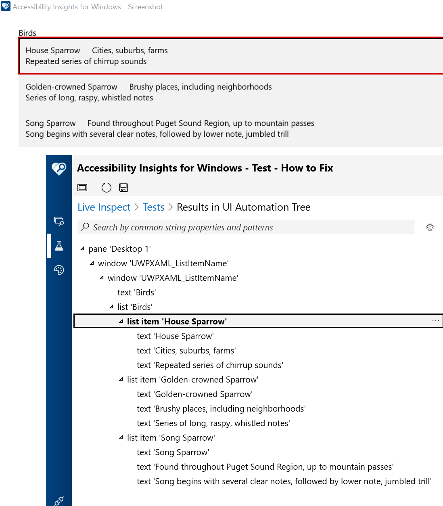

# UWPXAML_ListItemName

Depending on how list items are created, the items may be exposed through the UI Automation (UIA) API with a Name property built up from namespace and class names. When that gets announced by a screen reader, it's meaningless to customers. 

This sample app shows how one of the approaches listed at [UWP XAML: Setting the accessible name on a list item](https://docs.microsoft.com/en-us/accessibility-tools-docs/items/UWPXAML/ListItem_Name) can be used to resolve this.

The screenshot below shows the Accessibility Insights for Windows tool reporting the UIA Names for the list items in the sample app. Those UIA Names will be announced by screen readers when customers arrow through the list. Once at an item of interest, customers can use screen reader commands to move through the text contained within the item.

